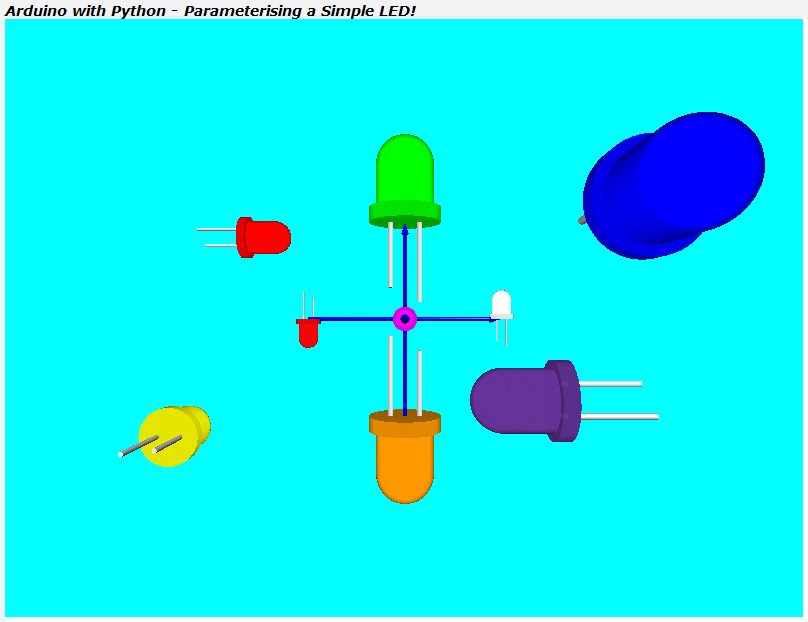

# TTB-AP-Lesson12
My Solution to Paul McWhorter's "Arduino with Python: LESSON 12" homework.

Visit Paul's video here:
 - https://youtu.be/watch?v=DcOT3gtVG8Y

You can get Paul's code here:
 - https://toptechboy.com/

You can see my solution demonstrated here:
 - https://youtu.be/t13NE_1oyvU

The Arduino sketch uses some simple multitasking with "millis()" to send and receive structured and CRC8 checked, data to/from Python. I now also have a watchdog monitoring the Arduino code.

I have revisited some of the Python code. The simple LED class and my crosshead screw function are now both fully parameterised and can be placed in the x, y, and z directions anywhere in 3D space, at whatever size required.

## My Simple LED - Parameterised:

## My Crosshead Screw - Parameterised:

